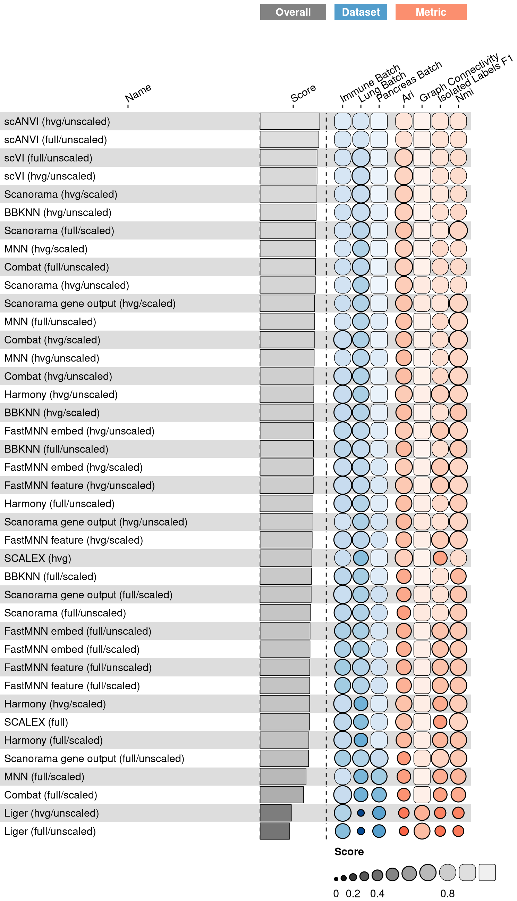
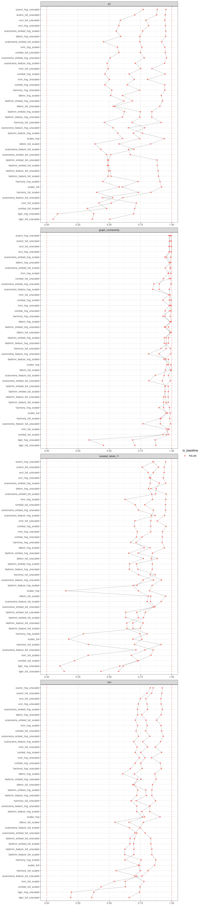

<link href="index_files/libs/datatables-css-0.0.0/datatables-crosstalk.css" rel="stylesheet" />

<link href="index_files/libs/dt-core-1.12.1/css/jquery.dataTables.min.css" rel="stylesheet" />
<link href="index_files/libs/dt-core-1.12.1/css/jquery.dataTables.extra.css" rel="stylesheet" />

<link href="index_files/libs/dt-ext-select-1.12.1/css/select.dataTables.min.css" rel="stylesheet" />

<link href="index_files/libs/dt-ext-searchpanes-1.12.1/css/searchPanes.dataTables.min.css" rel="stylesheet" />

<link href="index_files/libs/dt-ext-buttons-1.12.1/css/buttons.dataTables.min.css" rel="stylesheet" />

<link href="index_files/libs/crosstalk-1.2.0/css/crosstalk.min.css" rel="stylesheet" />

<link href="index_files/libs/lightable-0.0.1/lightable.css" rel="stylesheet" />

## Description

<!--- TODO: add links --->

## The task

This is a sub-task of the overall batch integration task. Batch (or data) integration
methods integrate datasets across batches that arise from various biological and
technical sources. Methods that integrate batches typically have three different types
of output: a corrected feature matrix, a joint embedding across batches, and/or an
integrated cell-cell similarity graph (e.g., a kNN graph). This sub-task focuses on all
methods that can output integrated graphs, and includes methods that canonically output
the other two data formats with subsequent postprocessing to generate a graph. Other
sub-tasks for batch integration can be found for:

-   [embeddings](../batch_integration_embed/), and
-   [corrected features](../batch_integration_feature/)

This sub-task was taken from a [benchmarking study of data integration
methods](https://openproblems.bio/bibliography#luecken2022benchmarking).

## Summary

<figure>

<figcaption aria-hidden="true">Overview of the results per method. This figures shows the mean of the scaled scores (group Overall), the mean scores per dataset (group Dataset) and the mean scores per metric (group Metric).</figcaption>
</figure>

## Metrics

-   **ARI**<a href="/bibliography#luecken2022benchmarking" target="_blank">1</a>: Missing 'metric_description'.

<!-- -->

-   **Graph connectivity**<a href="/bibliography#luecken2022benchmarking" target="_blank">1</a>: Missing 'metric_description'.

<!-- -->

-   **Isolated label F1**<a href="/bibliography#luecken2022benchmarking" target="_blank">1</a>: Missing 'metric_description'.

<!-- -->

-   **NMI**<a href="/bibliography#luecken2022benchmarking" target="_blank">1</a>: Missing 'metric_description'.

## Results

## Details

Methods

-   **Random Integration by Batch**<a href="/bibliography#openproblems" target="_blank">12</a>: Missing 'method_description'. Links: [Docs](https://github.com/openproblems-bio/openproblems).

<!-- -->

-   **BBKNN (full/scaled)**<a href="/bibliography#polanski2020bbknn" target="_blank">8</a>: Missing 'method_description'. Links: [Docs](https://github.com/Teichlab/bbknn).

<!-- -->

-   **BBKNN (full/unscaled)**<a href="/bibliography#polanski2020bbknn" target="_blank">8</a>: Missing 'method_description'. Links: [Docs](https://github.com/Teichlab/bbknn).

<!-- -->

-   **BBKNN (hvg/scaled)**<a href="/bibliography#polanski2020bbknn" target="_blank">8</a>: Missing 'method_description'. Links: [Docs](https://github.com/Teichlab/bbknn).

<!-- -->

-   **BBKNN (hvg/unscaled)**<a href="/bibliography#polanski2020bbknn" target="_blank">8</a>: Missing 'method_description'. Links: [Docs](https://github.com/Teichlab/bbknn).

<!-- -->

-   **Random Graph by Celltype**<a href="/bibliography#openproblems" target="_blank">12</a>: Missing 'method_description'. Links: [Docs](https://github.com/openproblems-bio/openproblems).

<!-- -->

-   **Random Integration by Celltype**<a href="/bibliography#openproblems" target="_blank">12</a>: Missing 'method_description'. Links: [Docs](https://github.com/openproblems-bio/openproblems).

<!-- -->

-   **Combat (full/scaled)**<a href="/bibliography#hansen2012removing" target="_blank">4</a>: Missing 'method_description'. Links: [Docs](https://scanpy.readthedocs.io/en/stable/api/scanpy.pp.combat.html).

<!-- -->

-   **Combat (full/unscaled)**<a href="/bibliography#hansen2012removing" target="_blank">4</a>: Missing 'method_description'. Links: [Docs](https://scanpy.readthedocs.io/en/stable/api/scanpy.pp.combat.html).

<!-- -->

-   **Combat (hvg/scaled)**<a href="/bibliography#hansen2012removing" target="_blank">4</a>: Missing 'method_description'. Links: [Docs](https://scanpy.readthedocs.io/en/stable/api/scanpy.pp.combat.html).

<!-- -->

-   **Combat (hvg/unscaled)**<a href="/bibliography#hansen2012removing" target="_blank">4</a>: Missing 'method_description'. Links: [Docs](https://scanpy.readthedocs.io/en/stable/api/scanpy.pp.combat.html).

<!-- -->

-   **FastMNN embed (full/scaled)**<a href="/bibliography#lun2019fastmnn" target="_blank">10</a>: Missing 'method_description'. Links: [Docs](https://doi.org/doi:10.18129/B9.bioc.batchelor).

<!-- -->

-   **FastMNN embed (full/unscaled)**<a href="/bibliography#lun2019fastmnn" target="_blank">10</a>: Missing 'method_description'. Links: [Docs](https://doi.org/doi:10.18129/B9.bioc.batchelor).

<!-- -->

-   **FastMNN embed (hvg/scaled)**<a href="/bibliography#lun2019fastmnn" target="_blank">10</a>: Missing 'method_description'. Links: [Docs](https://doi.org/doi:10.18129/B9.bioc.batchelor).

<!-- -->

-   **FastMNN embed (hvg/unscaled)**<a href="/bibliography#lun2019fastmnn" target="_blank">10</a>: Missing 'method_description'. Links: [Docs](https://doi.org/doi:10.18129/B9.bioc.batchelor).

<!-- -->

-   **FastMNN feature (full/scaled)**<a href="/bibliography#lun2019fastmnn" target="_blank">10</a>: Missing 'method_description'. Links: [Docs](https://doi.org/doi:10.18129/B9.bioc.batchelor).

<!-- -->

-   **FastMNN feature (full/unscaled)**<a href="/bibliography#lun2019fastmnn" target="_blank">10</a>: Missing 'method_description'. Links: [Docs](https://doi.org/doi:10.18129/B9.bioc.batchelor).

<!-- -->

-   **FastMNN feature (hvg/scaled)**<a href="/bibliography#lun2019fastmnn" target="_blank">10</a>: Missing 'method_description'. Links: [Docs](https://doi.org/doi:10.18129/B9.bioc.batchelor).

<!-- -->

-   **FastMNN feature (hvg/unscaled)**<a href="/bibliography#lun2019fastmnn" target="_blank">10</a>: Missing 'method_description'. Links: [Docs](https://doi.org/doi:10.18129/B9.bioc.batchelor).

<!-- -->

-   **Harmony (full/scaled)**<a href="/bibliography#korsunsky2019fast" target="_blank">7</a>: Missing 'method_description'. Links: [Docs](https://github.com/lilab-bcb/harmony-pytorch).

<!-- -->

-   **Harmony (full/unscaled)**<a href="/bibliography#korsunsky2019fast" target="_blank">7</a>: Missing 'method_description'. Links: [Docs](https://github.com/lilab-bcb/harmony-pytorch).

<!-- -->

-   **Harmony (hvg/scaled)**<a href="/bibliography#korsunsky2019fast" target="_blank">7</a>: Missing 'method_description'. Links: [Docs](https://github.com/lilab-bcb/harmony-pytorch).

<!-- -->

-   **Harmony (hvg/unscaled)**<a href="/bibliography#korsunsky2019fast" target="_blank">7</a>: Missing 'method_description'. Links: [Docs](https://github.com/lilab-bcb/harmony-pytorch).

<!-- -->

-   **Liger (full/unscaled)**<a href="/bibliography#welch2019single" target="_blank">11</a>: Missing 'method_description'. Links: [Docs](https://github.com/welch-lab/liger).

<!-- -->

-   **Liger (hvg/unscaled)**<a href="/bibliography#welch2019single" target="_blank">11</a>: Missing 'method_description'. Links: [Docs](https://github.com/welch-lab/liger).

<!-- -->

-   **MNN (full/scaled)**<a href="/bibliography#haghverdi2018batch" target="_blank">5</a>: Missing 'method_description'. Links: [Docs](https://github.com/chriscainx/mnnpy).

<!-- -->

-   **MNN (full/unscaled)**<a href="/bibliography#haghverdi2018batch" target="_blank">5</a>: Missing 'method_description'. Links: [Docs](https://github.com/chriscainx/mnnpy).

<!-- -->

-   **MNN (hvg/scaled)**<a href="/bibliography#haghverdi2018batch" target="_blank">5</a>: Missing 'method_description'. Links: [Docs](https://github.com/chriscainx/mnnpy).

<!-- -->

-   **MNN (hvg/unscaled)**<a href="/bibliography#haghverdi2018batch" target="_blank">5</a>: Missing 'method_description'. Links: [Docs](https://github.com/chriscainx/mnnpy).

<!-- -->

-   **No Integration**<a href="/bibliography#openproblems" target="_blank">12</a>: Missing 'method_description'. Links: [Docs](https://github.com/openproblems-bio/openproblems).

<!-- -->

-   **Random Integration**<a href="/bibliography#openproblems" target="_blank">12</a>: Missing 'method_description'. Links: [Docs](https://github.com/openproblems-bio/openproblems).

<!-- -->

-   **SCALEX (full)**<a href="/bibliography#xiong2021online" target="_blank">9</a>: Missing 'method_description'. Links: [Docs](https://github.com/jsxlei/SCALEX).

<!-- -->

-   **SCALEX (hvg)**<a href="/bibliography#xiong2021online" target="_blank">9</a>: Missing 'method_description'. Links: [Docs](https://github.com/jsxlei/SCALEX).

<!-- -->

-   **Scanorama (full/scaled)**<a href="/bibliography#hie2019efficient" target="_blank">2</a>: Missing 'method_description'. Links: [Docs](https://github.com/brianhie/scanorama).

<!-- -->

-   **Scanorama (full/unscaled)**<a href="/bibliography#hie2019efficient" target="_blank">2</a>: Missing 'method_description'. Links: [Docs](https://github.com/brianhie/scanorama).

<!-- -->

-   **Scanorama (hvg/scaled)**<a href="/bibliography#hie2019efficient" target="_blank">2</a>: Missing 'method_description'. Links: [Docs](https://github.com/brianhie/scanorama).

<!-- -->

-   **Scanorama (hvg/unscaled)**<a href="/bibliography#hie2019efficient" target="_blank">2</a>: Missing 'method_description'. Links: [Docs](https://github.com/brianhie/scanorama).

<!-- -->

-   **Scanorama gene output (full/scaled)**<a href="/bibliography#hie2019efficient" target="_blank">2</a>: Missing 'method_description'. Links: [Docs](https://github.com/brianhie/scanorama).

<!-- -->

-   **Scanorama gene output (full/unscaled)**<a href="/bibliography#hie2019efficient" target="_blank">2</a>: Missing 'method_description'. Links: [Docs](https://github.com/brianhie/scanorama).

<!-- -->

-   **Scanorama gene output (hvg/scaled)**<a href="/bibliography#hie2019efficient" target="_blank">2</a>: Missing 'method_description'. Links: [Docs](https://github.com/brianhie/scanorama).

<!-- -->

-   **Scanorama gene output (hvg/unscaled)**<a href="/bibliography#hie2019efficient" target="_blank">2</a>: Missing 'method_description'. Links: [Docs](https://github.com/brianhie/scanorama).

<!-- -->

-   **scANVI (full/unscaled)**<a href="/bibliography#xu2021probabilistic" target="_blank">3</a>: Missing 'method_description'. Links: [Docs](https://github.com/YosefLab/scvi-tools).

<!-- -->

-   **scANVI (hvg/unscaled)**<a href="/bibliography#xu2021probabilistic" target="_blank">3</a>: Missing 'method_description'. Links: [Docs](https://github.com/YosefLab/scvi-tools).

<!-- -->

-   **scVI (full/unscaled)**<a href="/bibliography#lopez2018deep" target="_blank">6</a>: Missing 'method_description'. Links: [Docs](https://github.com/YosefLab/scvi-tools).

<!-- -->

-   **scVI (hvg/unscaled)**<a href="/bibliography#lopez2018deep" target="_blank">6</a>: Missing 'method_description'. Links: [Docs](https://github.com/YosefLab/scvi-tools).

Baseline methods

-   **Random Integration by Batch**: Missing 'method_description'.

<!-- -->

-   **Random Graph by Celltype**: Missing 'method_description'.

<!-- -->

-   **Random Integration by Celltype**: Missing 'method_description'.

<!-- -->

-   **No Integration**: Missing 'method_description'.

<!-- -->

-   **Random Integration**: Missing 'method_description'.

Datasets

-   **Immune (by batch)**<a href="/bibliography#luecken2022benchmarking" target="_blank">1</a>: Missing 'dataset_description'.

<!-- -->

-   **Lung (Viera Braga et al.)**<a href="/bibliography#luecken2022benchmarking" target="_blank">1</a>: Missing 'dataset_description'.

<!-- -->

-   **Pancreas (by batch)**<a href="/bibliography#luecken2022benchmarking" target="_blank">1</a>: Missing 'dataset_description'.

Download raw data

<a href="data/task_info.json" class="btn btn-secondary">Task info</a>
<a href="data/method_info.json" class="btn btn-secondary">Method info</a>
<a href="data/metric_info.json" class="btn btn-secondary">Metric info</a>
<a href="data/dataset_info.json" class="btn btn-secondary">Dataset info</a>
<a href="data/results.json" class="btn btn-secondary">Results</a>
<a href="data/quality_control.json" class="btn btn-secondary">Quality control</a>

Quality control results

<table class="table lightable-paper" style='margin-left: auto; margin-right: auto; font-family: "Arial Narrow", arial, helvetica, sans-serif; margin-left: auto; margin-right: auto;'>
 <thead>
  <tr>
   <th style="text-align:left;"> Category </th>
   <th style="text-align:left;"> Name </th>
   <th style="text-align:right;"> Value </th>
   <th style="text-align:left;"> Condition </th>
   <th style="text-align:left;"> Severity </th>
  </tr>
 </thead>
<tbody>
  <tr>
   <td style="text-align:left;" data-toggle="tooltip" data-container="body" data-placement="right" title="Dataset metadata field 'dataset_description' should be defined
  Task id: batch_integration_graph
  Field: dataset_description
"> Dataset info </td>
   <td style="text-align:left;" data-toggle="tooltip" data-container="body" data-placement="right" title="Dataset metadata field 'dataset_description' should be defined
  Task id: batch_integration_graph
  Field: dataset_description
"> Pct 'dataset_description' missing </td>
   <td style="text-align:right;" data-toggle="tooltip" data-container="body" data-placement="right" title="Dataset metadata field 'dataset_description' should be defined
  Task id: batch_integration_graph
  Field: dataset_description
"> 1 </td>
   <td style="text-align:left;" data-toggle="tooltip" data-container="body" data-placement="right" title="Dataset metadata field 'dataset_description' should be defined
  Task id: batch_integration_graph
  Field: dataset_description
"> percent_missing(dataset_info, field) </td>
   <td style="text-align:left;color: red !important;" data-toggle="tooltip" data-container="body" data-placement="right" title="Dataset metadata field 'dataset_description' should be defined
  Task id: batch_integration_graph
  Field: dataset_description
"> ✗✗ </td>
  </tr>
  <tr>
   <td style="text-align:left;" data-toggle="tooltip" data-container="body" data-placement="right" title="Method metadata field 'method_description' should be defined
  Task id: batch_integration_graph
  Field: method_description
"> Method info </td>
   <td style="text-align:left;" data-toggle="tooltip" data-container="body" data-placement="right" title="Method metadata field 'method_description' should be defined
  Task id: batch_integration_graph
  Field: method_description
"> Pct 'method_description' missing </td>
   <td style="text-align:right;" data-toggle="tooltip" data-container="body" data-placement="right" title="Method metadata field 'method_description' should be defined
  Task id: batch_integration_graph
  Field: method_description
"> 1 </td>
   <td style="text-align:left;" data-toggle="tooltip" data-container="body" data-placement="right" title="Method metadata field 'method_description' should be defined
  Task id: batch_integration_graph
  Field: method_description
"> percent_missing(method_info, field) </td>
   <td style="text-align:left;color: red !important;" data-toggle="tooltip" data-container="body" data-placement="right" title="Method metadata field 'method_description' should be defined
  Task id: batch_integration_graph
  Field: method_description
"> ✗✗ </td>
  </tr>
  <tr>
   <td style="text-align:left;" data-toggle="tooltip" data-container="body" data-placement="right" title="Metric metadata field 'metric_description' should be defined
  Task id: batch_integration_graph
  Field: metric_description
"> Metric info </td>
   <td style="text-align:left;" data-toggle="tooltip" data-container="body" data-placement="right" title="Metric metadata field 'metric_description' should be defined
  Task id: batch_integration_graph
  Field: metric_description
"> Pct 'metric_description' missing </td>
   <td style="text-align:right;" data-toggle="tooltip" data-container="body" data-placement="right" title="Metric metadata field 'metric_description' should be defined
  Task id: batch_integration_graph
  Field: metric_description
"> 1 </td>
   <td style="text-align:left;" data-toggle="tooltip" data-container="body" data-placement="right" title="Metric metadata field 'metric_description' should be defined
  Task id: batch_integration_graph
  Field: metric_description
"> percent_missing(metric_info, field) </td>
   <td style="text-align:left;color: red !important;" data-toggle="tooltip" data-container="body" data-placement="right" title="Metric metadata field 'metric_description' should be defined
  Task id: batch_integration_graph
  Field: metric_description
"> ✗✗ </td>
  </tr>
</tbody>
</table>

Visualization of raw results

