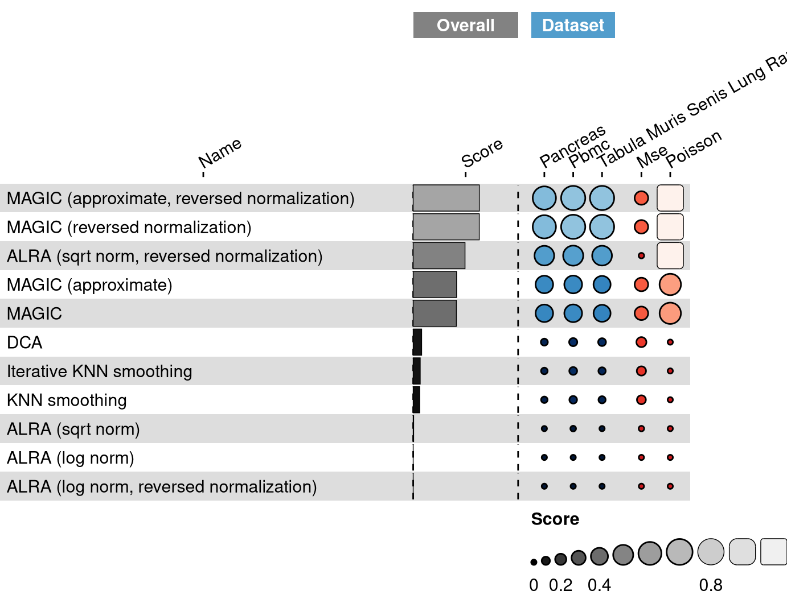

<link href="index_files/libs/datatables-css-0.0.0/datatables-crosstalk.css" rel="stylesheet" />

<link href="index_files/libs/dt-core-1.12.1/css/jquery.dataTables.min.css" rel="stylesheet" />
<link href="index_files/libs/dt-core-1.12.1/css/jquery.dataTables.extra.css" rel="stylesheet" />

<link href="index_files/libs/dt-ext-select-1.12.1/css/select.dataTables.min.css" rel="stylesheet" />

<link href="index_files/libs/dt-ext-searchpanes-1.12.1/css/searchPanes.dataTables.min.css" rel="stylesheet" />

<link href="index_files/libs/dt-ext-buttons-1.12.1/css/buttons.dataTables.min.css" rel="stylesheet" />

<link href="index_files/libs/crosstalk-1.2.0/css/crosstalk.min.css" rel="stylesheet" />

<link href="index_files/libs/lightable-0.0.1/lightable.css" rel="stylesheet" />

## Description

## The task

Single-cell RNA-Seq protocols only detect a fraction of the mRNA molecules present
in each cell. As a result, the measurements (UMI counts) observed for each gene and each
cell are associated with generally high levels of technical noise ([Grün et al.,
2014](https://openproblems.bio/bibliography#grn2014validation)). Denoising describes the
task of estimating the true expression level of each gene in each cell. In the
single-cell literature, this task is also referred to as *imputation*, a term which is
typically used for missing data problems in statistics. Similar to the use of the terms
"dropout", "missing data", and "technical zeros", this terminology can create confusion
about the underlying measurement process ([Sarkar and Stephens,
2021](https://openproblems.bio/bibliography#sarkar2021separating)).

A key challenge in evaluating denoising methods is the general lack of a ground truth. A
recent benchmark study ([Hou et al.,
2020](https://openproblems.bio/bibliography#hou2020systematic))
relied on flow-sorted datasets, mixture control experiments ([Tian et al.,
2019](https://openproblems.bio/bibliography#tian2019benchmarking)), and comparisons with
bulk RNA-Seq data. Since each of these approaches suffers from specific limitations, it
is difficult to combine these different approaches into a single quantitative measure of
denoising accuracy. Here, we instead rely on an approach termed molecular
cross-validation (MCV), which was specifically developed to quantify denoising accuracy
in the absence of a ground truth ([Batson et al.,
2019](https://openproblems.bio/bibliography#batson2019molecular)). In MCV, the observed
molecules in a given scRNA-Seq dataset are first partitioned between a *training* and a
*test* dataset. Next, a denoising method is applied to the training dataset. Finally,
denoising accuracy is measured by comparing the result to the test dataset. The authors
show that both in theory and in practice, the measured denoising accuracy is
representative of the accuracy that would be obtained on a ground truth dataset.

## Summary

<figure>

<figcaption aria-hidden="true">Overview of the results per method. This figures shows the mean of the scaled scores (group Overall), the mean scores per dataset (group Dataset) and the mean scores per metric (group Metric).</figcaption>
</figure>

## Metrics

-   **Mean-squared error**<a href="/bibliography#batson2019molecular" target="_blank">1</a>: Missing 'metric_description'.

<!-- -->

-   **Poisson loss**<a href="/bibliography#batson2019molecular" target="_blank">1</a>: Missing 'metric_description'.

## Results

## Details

Methods

-   **ALRA (log norm)**<a href="/bibliography#linderman2018zero" target="_blank">3</a>: Missing 'method_description'. Links: [Docs](https://github.com/KlugerLab/ALRA).

<!-- -->

-   **ALRA (log norm, reversed normalization)**<a href="/bibliography#linderman2018zero" target="_blank">3</a>: Missing 'method_description'. Links: [Docs](https://github.com/KlugerLab/ALRA).

<!-- -->

-   **ALRA (sqrt norm)**<a href="/bibliography#linderman2018zero" target="_blank">3</a>: Missing 'method_description'. Links: [Docs](https://github.com/KlugerLab/ALRA).

<!-- -->

-   **ALRA (sqrt norm, reversed normalization)**<a href="/bibliography#linderman2018zero" target="_blank">3</a>: Missing 'method_description'. Links: [Docs](https://github.com/KlugerLab/ALRA).

<!-- -->

-   **DCA**<a href="/bibliography#eraslan2019single" target="_blank">4</a>: Missing 'method_description'. Links: [Docs](https://github.com/theislab/dca).

<!-- -->

-   **KNN smoothing**<a href="/bibliography#openproblems" target="_blank">5</a>: Missing 'method_description'. Links: [Docs](https://github.com/openproblems-bio/openproblems).

<!-- -->

-   **Iterative KNN smoothing**<a href="/bibliography#wagner2018knearest" target="_blank">6</a>: Missing 'method_description'. Links: [Docs](https://github.com/yanailab/knn-smoothing).

<!-- -->

-   **MAGIC**<a href="/bibliography#van2018recovering" target="_blank">2</a>: Missing 'method_description'. Links: [Docs](https://github.com/KrishnaswamyLab/MAGIC).

<!-- -->

-   **MAGIC (approximate)**<a href="/bibliography#van2018recovering" target="_blank">2</a>: Missing 'method_description'. Links: [Docs](https://github.com/KrishnaswamyLab/MAGIC).

<!-- -->

-   **MAGIC (approximate, reversed normalization)**<a href="/bibliography#van2018recovering" target="_blank">2</a>: Missing 'method_description'. Links: [Docs](https://github.com/KrishnaswamyLab/MAGIC).

<!-- -->

-   **MAGIC (reversed normalization)**<a href="/bibliography#van2018recovering" target="_blank">2</a>: Missing 'method_description'. Links: [Docs](https://github.com/KrishnaswamyLab/MAGIC).

<!-- -->

-   **No denoising**<a href="/bibliography#openproblems" target="_blank">5</a>: Missing 'method_description'. Links: [Docs](https://github.com/openproblems-bio/openproblems).

<!-- -->

-   **Perfect denoising**<a href="/bibliography#openproblems" target="_blank">5</a>: Missing 'method_description'. Links: [Docs](https://github.com/openproblems-bio/openproblems).

Baseline methods

-   **No denoising**: Missing 'method_description'.

<!-- -->

-   **Perfect denoising**: Missing 'method_description'.

Datasets

-   **Pancreas (inDrop)**<a href="/bibliography#luecken2022benchmarking" target="_blank">9</a>: Missing 'dataset_description'.

<!-- -->

-   **1k Peripheral blood mononuclear cells**<a href="/bibliography#10x2018pbmc" target="_blank">8</a>: Missing 'dataset_description'.

<!-- -->

-   **Tabula Muris Senis Lung**<a href="/bibliography#tabula2020single" target="_blank">7</a>: Missing 'dataset_description'.

Download raw data

<a href="data/task_info.json" class="btn btn-secondary">Task info</a>
<a href="data/method_info.json" class="btn btn-secondary">Method info</a>
<a href="data/metric_info.json" class="btn btn-secondary">Metric info</a>
<a href="data/dataset_info.json" class="btn btn-secondary">Dataset info</a>
<a href="data/results.json" class="btn btn-secondary">Results</a>
<a href="data/quality_control.json" class="btn btn-secondary">Quality control</a>

Quality control results

<table class="table lightable-paper" style='margin-left: auto; margin-right: auto; font-family: "Arial Narrow", arial, helvetica, sans-serif; margin-left: auto; margin-right: auto;'>
 <thead>
  <tr>
   <th style="text-align:left;"> Category </th>
   <th style="text-align:left;"> Name </th>
   <th style="text-align:right;"> Value </th>
   <th style="text-align:left;"> Condition </th>
   <th style="text-align:left;"> Severity </th>
  </tr>
 </thead>
<tbody>
  <tr>
   <td style="text-align:left;" data-toggle="tooltip" data-container="body" data-placement="right" title="Method knn_smoothing performs much worse than baselines.
  Task id: denoising
  Method id: knn_smoothing
  Metric id: poisson
  Worst score: -10.298315065894421%
"> Scaling </td>
   <td style="text-align:left;" data-toggle="tooltip" data-container="body" data-placement="right" title="Method knn_smoothing performs much worse than baselines.
  Task id: denoising
  Method id: knn_smoothing
  Metric id: poisson
  Worst score: -10.298315065894421%
"> Worst score knn_smoothing poisson </td>
   <td style="text-align:right;" data-toggle="tooltip" data-container="body" data-placement="right" title="Method knn_smoothing performs much worse than baselines.
  Task id: denoising
  Method id: knn_smoothing
  Metric id: poisson
  Worst score: -10.298315065894421%
"> -10.29832 </td>
   <td style="text-align:left;" data-toggle="tooltip" data-container="body" data-placement="right" title="Method knn_smoothing performs much worse than baselines.
  Task id: denoising
  Method id: knn_smoothing
  Metric id: poisson
  Worst score: -10.298315065894421%
"> worst_score &gt;= -1 </td>
   <td style="text-align:left;color: red !important;" data-toggle="tooltip" data-container="body" data-placement="right" title="Method knn_smoothing performs much worse than baselines.
  Task id: denoising
  Method id: knn_smoothing
  Metric id: poisson
  Worst score: -10.298315065894421%
"> ✗✗✗ </td>
  </tr>
  <tr>
   <td style="text-align:left;" data-toggle="tooltip" data-container="body" data-placement="right" title="Dataset metadata field 'dataset_description' should be defined
  Task id: denoising
  Field: dataset_description
"> Dataset info </td>
   <td style="text-align:left;" data-toggle="tooltip" data-container="body" data-placement="right" title="Dataset metadata field 'dataset_description' should be defined
  Task id: denoising
  Field: dataset_description
"> Pct 'dataset_description' missing </td>
   <td style="text-align:right;" data-toggle="tooltip" data-container="body" data-placement="right" title="Dataset metadata field 'dataset_description' should be defined
  Task id: denoising
  Field: dataset_description
"> 1.00000 </td>
   <td style="text-align:left;" data-toggle="tooltip" data-container="body" data-placement="right" title="Dataset metadata field 'dataset_description' should be defined
  Task id: denoising
  Field: dataset_description
"> percent_missing(dataset_info, field) </td>
   <td style="text-align:left;color: red !important;" data-toggle="tooltip" data-container="body" data-placement="right" title="Dataset metadata field 'dataset_description' should be defined
  Task id: denoising
  Field: dataset_description
"> ✗✗ </td>
  </tr>
  <tr>
   <td style="text-align:left;" data-toggle="tooltip" data-container="body" data-placement="right" title="Method metadata field 'method_description' should be defined
  Task id: denoising
  Field: method_description
"> Method info </td>
   <td style="text-align:left;" data-toggle="tooltip" data-container="body" data-placement="right" title="Method metadata field 'method_description' should be defined
  Task id: denoising
  Field: method_description
"> Pct 'method_description' missing </td>
   <td style="text-align:right;" data-toggle="tooltip" data-container="body" data-placement="right" title="Method metadata field 'method_description' should be defined
  Task id: denoising
  Field: method_description
"> 1.00000 </td>
   <td style="text-align:left;" data-toggle="tooltip" data-container="body" data-placement="right" title="Method metadata field 'method_description' should be defined
  Task id: denoising
  Field: method_description
"> percent_missing(method_info, field) </td>
   <td style="text-align:left;color: red !important;" data-toggle="tooltip" data-container="body" data-placement="right" title="Method metadata field 'method_description' should be defined
  Task id: denoising
  Field: method_description
"> ✗✗ </td>
  </tr>
  <tr>
   <td style="text-align:left;" data-toggle="tooltip" data-container="body" data-placement="right" title="Metric metadata field 'metric_description' should be defined
  Task id: denoising
  Field: metric_description
"> Metric info </td>
   <td style="text-align:left;" data-toggle="tooltip" data-container="body" data-placement="right" title="Metric metadata field 'metric_description' should be defined
  Task id: denoising
  Field: metric_description
"> Pct 'metric_description' missing </td>
   <td style="text-align:right;" data-toggle="tooltip" data-container="body" data-placement="right" title="Metric metadata field 'metric_description' should be defined
  Task id: denoising
  Field: metric_description
"> 1.00000 </td>
   <td style="text-align:left;" data-toggle="tooltip" data-container="body" data-placement="right" title="Metric metadata field 'metric_description' should be defined
  Task id: denoising
  Field: metric_description
"> percent_missing(metric_info, field) </td>
   <td style="text-align:left;color: red !important;" data-toggle="tooltip" data-container="body" data-placement="right" title="Metric metadata field 'metric_description' should be defined
  Task id: denoising
  Field: metric_description
"> ✗✗ </td>
  </tr>
</tbody>
</table>

Visualization of raw results

