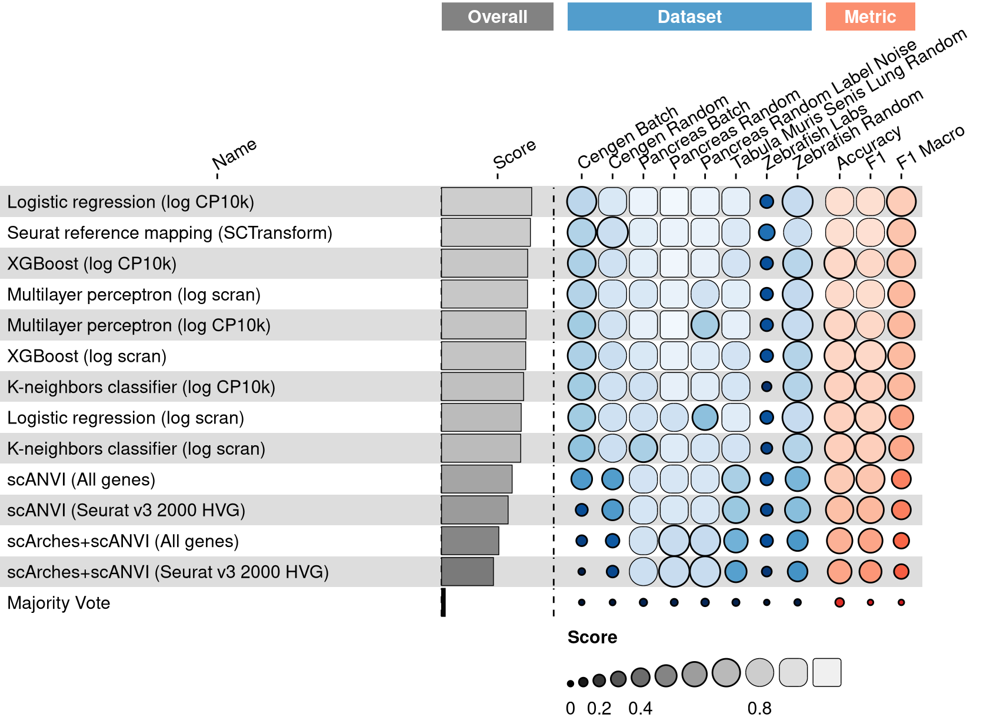
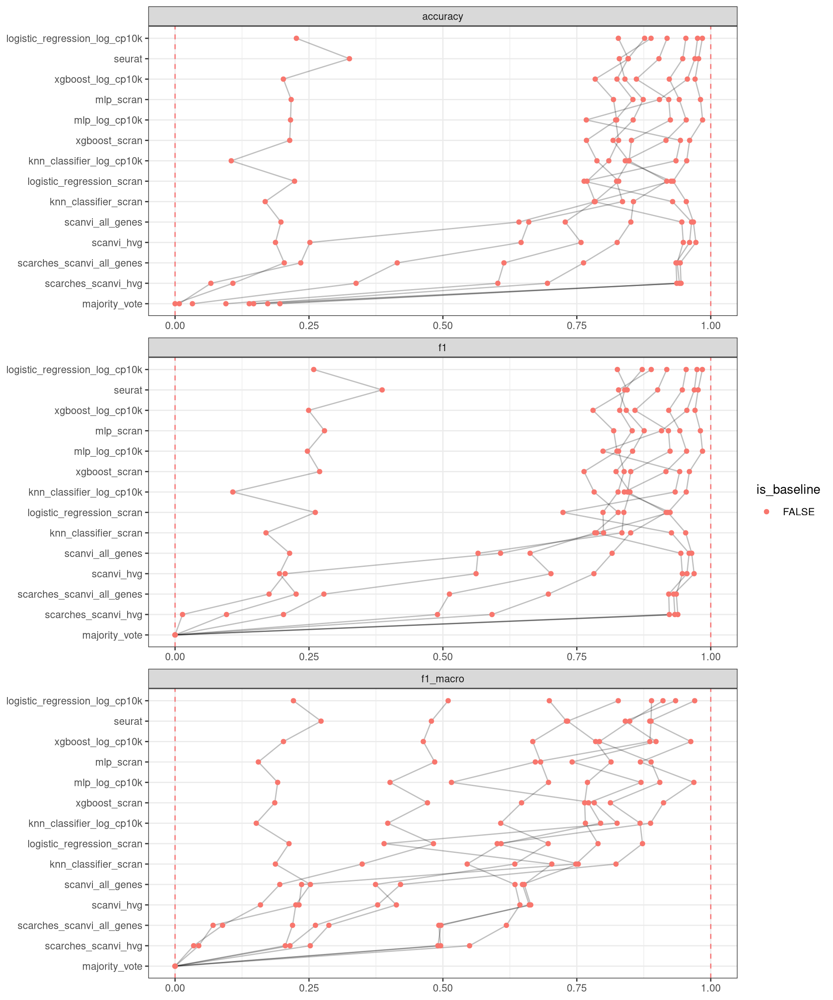

<link href="index_files/libs/datatables-css-0.0.0/datatables-crosstalk.css" rel="stylesheet" />

<link href="index_files/libs/dt-core-1.12.1/css/jquery.dataTables.min.css" rel="stylesheet" />
<link href="index_files/libs/dt-core-1.12.1/css/jquery.dataTables.extra.css" rel="stylesheet" />

<link href="index_files/libs/dt-ext-select-1.12.1/css/select.dataTables.min.css" rel="stylesheet" />

<link href="index_files/libs/dt-ext-searchpanes-1.12.1/css/searchPanes.dataTables.min.css" rel="stylesheet" />

<link href="index_files/libs/dt-ext-buttons-1.12.1/css/buttons.dataTables.min.css" rel="stylesheet" />

<link href="index_files/libs/crosstalk-1.2.0/css/crosstalk.min.css" rel="stylesheet" />

<link href="index_files/libs/lightable-0.0.1/lightable.css" rel="stylesheet" />

## Description

## The task

A major challenge for integrating single cell datasets is creating matching cell type
annotations for each cell. One of the most common strategies for annotating cell types
is referred to as
["cluster-then-annotate"](https://openproblems.bio/bibliography#kiselev2019challenges) whereby
cells are aggregated into clusters based on feature similarity and then manually
characterized based on differential gene expression or previously identified marker
genes. Recently, methods have emerged to build on this strategy and annotate cells
using [known marker genes](https://openproblems.bio/bibliography#pliner2019supervised). However,
these strategies pose a difficulty for integrating atlas-scale datasets as the
particular annotations may not match.

To ensure that the cell type labels in newly generated datasets match existing reference
datasets, some methods align cells to a previously annotated [reference
dataset](https://openproblems.bio/bibliography#hou2019scmatch) and then
*project* labels from the reference to the new dataset.

Here, we compare methods for annotation based on a reference dataset. The datasets
consist of two or more samples of single cell profiles that have been manually annotated
with matching labels. These datasets are then split into training and test batches, and
the task of each method is to train a cell type classifer on the training set and
project those labels onto the test set.

## Summary

<figure>

<figcaption aria-hidden="true">Overview of the results per method. This figures shows the mean of the scaled scores (group Overall), the mean scores per dataset (group Dataset) and the mean scores per metric (group Metric).</figcaption>
</figure>

## Metrics

-   **Accuracy**<a href="/bibliography#grandini2020metrics" target="_blank">1</a>: Missing 'metric_description'.

<!-- -->

-   **F1 score**<a href="/bibliography#grandini2020metrics" target="_blank">1</a>: Missing 'metric_description'.

<!-- -->

-   **Macro F1 score**<a href="/bibliography#grandini2020metrics" target="_blank">1</a>: Missing 'metric_description'.

## Results

## Details

Methods

-   **K-neighbors classifier (log CP10k)**<a href="/bibliography#cover1967nearest" target="_blank">6</a>: Missing 'method_description'. Links: [Docs](https://scikit-learn.org/stable/modules/generated/sklearn.neighbors.KNeighborsClassifier.html).

<!-- -->

-   **K-neighbors classifier (log scran)**<a href="/bibliography#cover1967nearest" target="_blank">6</a>: Missing 'method_description'. Links: [Docs](https://scikit-learn.org/stable/modules/generated/sklearn.neighbors.KNeighborsClassifier.html).

<!-- -->

-   **Logistic regression (log CP10k)**<a href="/bibliography#hosmer2013applied" target="_blank">2</a>: Missing 'method_description'. Links: [Docs](https://scikit-learn.org/stable/modules/generated/sklearn.linear_model.LogisticRegression.html).

<!-- -->

-   **Logistic regression (log scran)**<a href="/bibliography#hosmer2013applied" target="_blank">2</a>: Missing 'method_description'. Links: [Docs](https://scikit-learn.org/stable/modules/generated/sklearn.linear_model.LogisticRegression.html).

<!-- -->

-   **Majority Vote**<a href="/bibliography#openproblems" target="_blank">9</a>: Missing 'method_description'. Links: [Docs](https://github.com/openproblems-bio/openproblems).

<!-- -->

-   **Multilayer perceptron (log CP10k)**<a href="/bibliography#hinton1989connectionist" target="_blank">3</a>: Missing 'method_description'. Links: [Docs](https://scikit-learn.org/stable/modules/generated/sklearn.neural_network.MLPClassifier.html).

<!-- -->

-   **Multilayer perceptron (log scran)**<a href="/bibliography#hinton1989connectionist" target="_blank">3</a>: Missing 'method_description'. Links: [Docs](https://scikit-learn.org/stable/modules/generated/sklearn.neural_network.MLPClassifier.html).

<!-- -->

-   **Random Labels**<a href="/bibliography#openproblems" target="_blank">9</a>: Missing 'method_description'. Links: [Docs](https://github.com/openproblems-bio/openproblems).

<!-- -->

-   **scANVI (All genes)**<a href="/bibliography#xu2021probabilistic" target="_blank">7</a>: Missing 'method_description'. Links: [Docs](https://github.com/YosefLab/scvi-tools).

<!-- -->

-   **scANVI (Seurat v3 2000 HVG)**<a href="/bibliography#xu2021probabilistic" target="_blank">7</a>: Missing 'method_description'. Links: [Docs](https://github.com/YosefLab/scvi-tools).

<!-- -->

-   **scArches+scANVI (All genes)**<a href="/bibliography#lotfollahi2020query" target="_blank">8</a>: Missing 'method_description'. Links: [Docs](https://github.com/YosefLab/scvi-tools).

<!-- -->

-   **scArches+scANVI (Seurat v3 2000 HVG)**<a href="/bibliography#lotfollahi2020query" target="_blank">8</a>: Missing 'method_description'. Links: [Docs](https://github.com/YosefLab/scvi-tools).

<!-- -->

-   **Seurat reference mapping (SCTransform)**<a href="/bibliography#hao2021integrated" target="_blank">5</a>: Missing 'method_description'. Links: [Docs](https://github.com/satijalab/seurat).

<!-- -->

-   **True Labels**<a href="/bibliography#openproblems" target="_blank">9</a>: Missing 'method_description'. Links: [Docs](https://github.com/openproblems-bio/openproblems).

<!-- -->

-   **XGBoost (log CP10k)**<a href="/bibliography#chen2016xgboost" target="_blank">4</a>: Missing 'method_description'. Links: [Docs](https://xgboost.readthedocs.io/en/stable/index.html).

<!-- -->

-   **XGBoost (log scran)**<a href="/bibliography#chen2016xgboost" target="_blank">4</a>: Missing 'method_description'. Links: [Docs](https://xgboost.readthedocs.io/en/stable/index.html).

Baseline methods

-   **Random Labels**: Missing 'method_description'.

<!-- -->

-   **True Labels**: Missing 'method_description'.

Datasets

-   **CeNGEN (split by batch)**<a href="/bibliography#hammarlund2018cengen" target="_blank">12</a>: Missing 'dataset_description'.

<!-- -->

-   **CeNGEN (random split)**<a href="/bibliography#hammarlund2018cengen" target="_blank">12</a>: Missing 'dataset_description'.

<!-- -->

-   **Pancreas (by batch)**<a href="/bibliography#luecken2022benchmarking" target="_blank">10</a>: Missing 'dataset_description'.

<!-- -->

-   **Pancreas (random split)**<a href="/bibliography#luecken2022benchmarking" target="_blank">10</a>: Missing 'dataset_description'.

<!-- -->

-   **Pancreas (random split with label noise)**<a href="/bibliography#luecken2022benchmarking" target="_blank">10</a>: Missing 'dataset_description'.

<!-- -->

-   **Tabula Muris Senis Lung (random split)**<a href="/bibliography#tabula2020single" target="_blank">11</a>: Missing 'dataset_description'.

<!-- -->

-   **Zebrafish (by laboratory)**<a href="/bibliography#wagner2018single" target="_blank">13</a>: Missing 'dataset_description'.

<!-- -->

-   **Zebrafish (random split)**<a href="/bibliography#wagner2018single" target="_blank">13</a>: Missing 'dataset_description'.

Download raw data

<a href="data/task_info.json" class="btn btn-secondary">Task info</a>
<a href="data/method_info.json" class="btn btn-secondary">Method info</a>
<a href="data/metric_info.json" class="btn btn-secondary">Metric info</a>
<a href="data/dataset_info.json" class="btn btn-secondary">Dataset info</a>
<a href="data/results.json" class="btn btn-secondary">Results</a>
<a href="data/quality_control.json" class="btn btn-secondary">Quality control</a>

Quality control results

<table class="table lightable-paper" style='margin-left: auto; margin-right: auto; font-family: "Arial Narrow", arial, helvetica, sans-serif; margin-left: auto; margin-right: auto;'>
 <thead>
  <tr>
   <th style="text-align:left;"> Category </th>
   <th style="text-align:left;"> Name </th>
   <th style="text-align:right;"> Value </th>
   <th style="text-align:left;"> Condition </th>
   <th style="text-align:left;"> Severity </th>
  </tr>
 </thead>
<tbody>
  <tr>
   <td style="text-align:left;" data-toggle="tooltip" data-container="body" data-placement="right" title="Dataset metadata field 'dataset_description' should be defined
  Task id: label_projection
  Field: dataset_description
"> Dataset info </td>
   <td style="text-align:left;" data-toggle="tooltip" data-container="body" data-placement="right" title="Dataset metadata field 'dataset_description' should be defined
  Task id: label_projection
  Field: dataset_description
"> Pct 'dataset_description' missing </td>
   <td style="text-align:right;" data-toggle="tooltip" data-container="body" data-placement="right" title="Dataset metadata field 'dataset_description' should be defined
  Task id: label_projection
  Field: dataset_description
"> 1 </td>
   <td style="text-align:left;" data-toggle="tooltip" data-container="body" data-placement="right" title="Dataset metadata field 'dataset_description' should be defined
  Task id: label_projection
  Field: dataset_description
"> percent_missing(dataset_info, field) </td>
   <td style="text-align:left;color: red !important;" data-toggle="tooltip" data-container="body" data-placement="right" title="Dataset metadata field 'dataset_description' should be defined
  Task id: label_projection
  Field: dataset_description
"> ✗✗ </td>
  </tr>
  <tr>
   <td style="text-align:left;" data-toggle="tooltip" data-container="body" data-placement="right" title="Method metadata field 'method_description' should be defined
  Task id: label_projection
  Field: method_description
"> Method info </td>
   <td style="text-align:left;" data-toggle="tooltip" data-container="body" data-placement="right" title="Method metadata field 'method_description' should be defined
  Task id: label_projection
  Field: method_description
"> Pct 'method_description' missing </td>
   <td style="text-align:right;" data-toggle="tooltip" data-container="body" data-placement="right" title="Method metadata field 'method_description' should be defined
  Task id: label_projection
  Field: method_description
"> 1 </td>
   <td style="text-align:left;" data-toggle="tooltip" data-container="body" data-placement="right" title="Method metadata field 'method_description' should be defined
  Task id: label_projection
  Field: method_description
"> percent_missing(method_info, field) </td>
   <td style="text-align:left;color: red !important;" data-toggle="tooltip" data-container="body" data-placement="right" title="Method metadata field 'method_description' should be defined
  Task id: label_projection
  Field: method_description
"> ✗✗ </td>
  </tr>
  <tr>
   <td style="text-align:left;" data-toggle="tooltip" data-container="body" data-placement="right" title="Metric metadata field 'metric_description' should be defined
  Task id: label_projection
  Field: metric_description
"> Metric info </td>
   <td style="text-align:left;" data-toggle="tooltip" data-container="body" data-placement="right" title="Metric metadata field 'metric_description' should be defined
  Task id: label_projection
  Field: metric_description
"> Pct 'metric_description' missing </td>
   <td style="text-align:right;" data-toggle="tooltip" data-container="body" data-placement="right" title="Metric metadata field 'metric_description' should be defined
  Task id: label_projection
  Field: metric_description
"> 1 </td>
   <td style="text-align:left;" data-toggle="tooltip" data-container="body" data-placement="right" title="Metric metadata field 'metric_description' should be defined
  Task id: label_projection
  Field: metric_description
"> percent_missing(metric_info, field) </td>
   <td style="text-align:left;color: red !important;" data-toggle="tooltip" data-container="body" data-placement="right" title="Metric metadata field 'metric_description' should be defined
  Task id: label_projection
  Field: metric_description
"> ✗✗ </td>
  </tr>
</tbody>
</table>

Visualization of raw results

