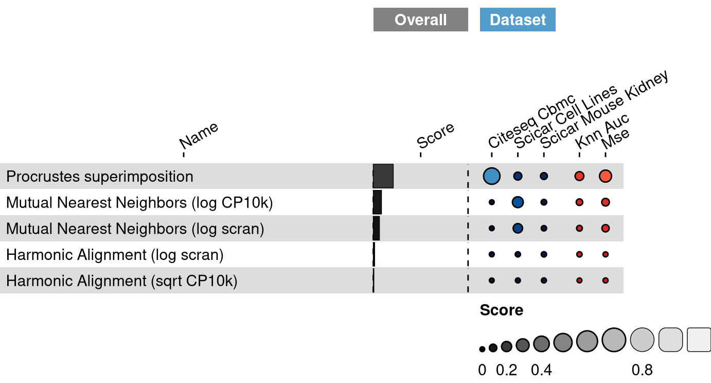
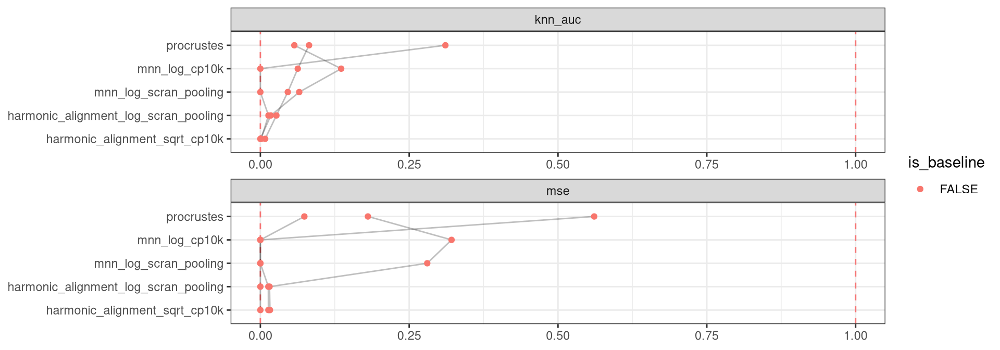

<link href="index_files/libs/datatables-css-0.0.0/datatables-crosstalk.css" rel="stylesheet" />

<link href="index_files/libs/dt-core-1.12.1/css/jquery.dataTables.min.css" rel="stylesheet" />
<link href="index_files/libs/dt-core-1.12.1/css/jquery.dataTables.extra.css" rel="stylesheet" />

<link href="index_files/libs/dt-ext-select-1.12.1/css/select.dataTables.min.css" rel="stylesheet" />

<link href="index_files/libs/dt-ext-searchpanes-1.12.1/css/searchPanes.dataTables.min.css" rel="stylesheet" />

<link href="index_files/libs/dt-ext-buttons-1.12.1/css/buttons.dataTables.min.css" rel="stylesheet" />

<link href="index_files/libs/crosstalk-1.2.0/css/crosstalk.min.css" rel="stylesheet" />

<link href="index_files/libs/lightable-0.0.1/lightable.css" rel="stylesheet" />

## Description

## The task

Cellular function is regulated by the complex interplay of different types of biological
molecules (DNA, RNA, proteins, etc.), which determine the state of a cell. Several
recently described technologies allow for simultaneous measurement of different aspects
of cellular state. For example, [sci-CAR](https://openproblems.bio/bibliography#cao2018joint)
jointly profiles RNA expression and chromatin accessibility on the same cell and
[CITE-seq](https://openproblems.bio/bibliography#stoeckius2017simultaneous) measures
surface protein abundance and RNA expression from each cell. These technologies enable
us to better understand cellular function, however datasets are still rare and there are
tradeoffs that these measurements make for to profile multiple modalities.

Joint methods can be more expensive or lower throughput or more noisy than measuring a
single modality at a time. Therefore it is useful to develop methods that are capable
of integrating measurements of the same biological system but obtained using different
technologies on different cells.

Here the goal is to learn a latent space where cells profiled by different technologies in
different modalities are matched if they have the same state. We use jointly profiled
data as ground truth so that we can evaluate when the observations from the same cell
acquired using different modalities are similar. A perfect result has each of the paired
observations sharing the same coordinates in the latent space.

## Summary

<figure>

<figcaption aria-hidden="true">Overview of the results per method. This figures shows the mean of the scaled scores (group Overall), the mean scores per dataset (group Dataset) and the mean scores per metric (group Metric).</figcaption>
</figure>

## Metrics

-   **kNN Area Under the Curve**<a href="/bibliography#stanley2020harmonic" target="_blank">1</a>: Missing 'metric_description'.

<!-- -->

-   **Mean squared error**<a href="/bibliography#lance2022multimodal" target="_blank">2</a>: Missing 'metric_description'.

## Results

## Details

Methods

-   **Harmonic Alignment (log scran)**<a href="/bibliography#stanley2020harmonic" target="_blank">1</a>: Missing 'method_description'. Links: [Docs](https://github.com/KrishnaswamyLab/harmonic-alignment).

<!-- -->

-   **Harmonic Alignment (sqrt CP10k)**<a href="/bibliography#stanley2020harmonic" target="_blank">1</a>: Missing 'method_description'. Links: [Docs](https://github.com/KrishnaswamyLab/harmonic-alignment).

<!-- -->

-   **Mutual Nearest Neighbors (log CP10k)**<a href="/bibliography#haghverdi2018batch" target="_blank">4</a>: Missing 'method_description'. Links: [Docs](https://github.com/LTLA/batchelor).

<!-- -->

-   **Mutual Nearest Neighbors (log scran)**<a href="/bibliography#haghverdi2018batch" target="_blank">4</a>: Missing 'method_description'. Links: [Docs](https://github.com/LTLA/batchelor).

<!-- -->

-   **Procrustes superimposition**<a href="/bibliography#gower1975generalized" target="_blank">3</a>: Missing 'method_description'. Links: [Docs](https://docs.scipy.org/doc/scipy/reference/generated/scipy.spatial.procrustes.html).

<!-- -->

-   **Random Features**<a href="/bibliography#openproblems" target="_blank">7</a>: Missing 'method_description'. Links: [Docs](https://github.com/openproblems-bio/openproblems).

<!-- -->

-   **True Features**<a href="/bibliography#openproblems" target="_blank">7</a>: Missing 'method_description'. Links: [Docs](https://github.com/openproblems-bio/openproblems).

Baseline methods

-   **Random Features**: Missing 'method_description'.

<!-- -->

-   **True Features**: Missing 'method_description'.

Datasets

-   **CITE-seq Cord Blood Mononuclear Cells**<a href="/bibliography#stoeckius2017simultaneous" target="_blank">5</a>: Missing 'dataset_description'.

<!-- -->

-   **sciCAR Cell Lines**<a href="/bibliography#cao2018joint" target="_blank">6</a>: Missing 'dataset_description'.

<!-- -->

-   **sciCAR Mouse Kidney**<a href="/bibliography#cao2018joint" target="_blank">6</a>: Missing 'dataset_description'.

Download raw data

<a href="data/task_info.json" class="btn btn-secondary">Task info</a>
<a href="data/method_info.json" class="btn btn-secondary">Method info</a>
<a href="data/metric_info.json" class="btn btn-secondary">Metric info</a>
<a href="data/dataset_info.json" class="btn btn-secondary">Dataset info</a>
<a href="data/results.json" class="btn btn-secondary">Results</a>
<a href="data/quality_control.json" class="btn btn-secondary">Quality control</a>

Quality control results

<table class="table lightable-paper" style='margin-left: auto; margin-right: auto; font-family: "Arial Narrow", arial, helvetica, sans-serif; margin-left: auto; margin-right: auto;'>
 <thead>
  <tr>
   <th style="text-align:left;"> Category </th>
   <th style="text-align:left;"> Name </th>
   <th style="text-align:right;"> Value </th>
   <th style="text-align:left;"> Condition </th>
   <th style="text-align:left;"> Severity </th>
  </tr>
 </thead>
<tbody>
  <tr>
   <td style="text-align:left;" data-toggle="tooltip" data-container="body" data-placement="right" title="Dataset metadata field 'dataset_description' should be defined
  Task id: matching_modalities
  Field: dataset_description
"> Dataset info </td>
   <td style="text-align:left;" data-toggle="tooltip" data-container="body" data-placement="right" title="Dataset metadata field 'dataset_description' should be defined
  Task id: matching_modalities
  Field: dataset_description
"> Pct 'dataset_description' missing </td>
   <td style="text-align:right;" data-toggle="tooltip" data-container="body" data-placement="right" title="Dataset metadata field 'dataset_description' should be defined
  Task id: matching_modalities
  Field: dataset_description
"> 1 </td>
   <td style="text-align:left;" data-toggle="tooltip" data-container="body" data-placement="right" title="Dataset metadata field 'dataset_description' should be defined
  Task id: matching_modalities
  Field: dataset_description
"> percent_missing(dataset_info, field) </td>
   <td style="text-align:left;color: red !important;" data-toggle="tooltip" data-container="body" data-placement="right" title="Dataset metadata field 'dataset_description' should be defined
  Task id: matching_modalities
  Field: dataset_description
"> ✗✗ </td>
  </tr>
  <tr>
   <td style="text-align:left;" data-toggle="tooltip" data-container="body" data-placement="right" title="Method metadata field 'method_description' should be defined
  Task id: matching_modalities
  Field: method_description
"> Method info </td>
   <td style="text-align:left;" data-toggle="tooltip" data-container="body" data-placement="right" title="Method metadata field 'method_description' should be defined
  Task id: matching_modalities
  Field: method_description
"> Pct 'method_description' missing </td>
   <td style="text-align:right;" data-toggle="tooltip" data-container="body" data-placement="right" title="Method metadata field 'method_description' should be defined
  Task id: matching_modalities
  Field: method_description
"> 1 </td>
   <td style="text-align:left;" data-toggle="tooltip" data-container="body" data-placement="right" title="Method metadata field 'method_description' should be defined
  Task id: matching_modalities
  Field: method_description
"> percent_missing(method_info, field) </td>
   <td style="text-align:left;color: red !important;" data-toggle="tooltip" data-container="body" data-placement="right" title="Method metadata field 'method_description' should be defined
  Task id: matching_modalities
  Field: method_description
"> ✗✗ </td>
  </tr>
  <tr>
   <td style="text-align:left;" data-toggle="tooltip" data-container="body" data-placement="right" title="Metric metadata field 'metric_description' should be defined
  Task id: matching_modalities
  Field: metric_description
"> Metric info </td>
   <td style="text-align:left;" data-toggle="tooltip" data-container="body" data-placement="right" title="Metric metadata field 'metric_description' should be defined
  Task id: matching_modalities
  Field: metric_description
"> Pct 'metric_description' missing </td>
   <td style="text-align:right;" data-toggle="tooltip" data-container="body" data-placement="right" title="Metric metadata field 'metric_description' should be defined
  Task id: matching_modalities
  Field: metric_description
"> 1 </td>
   <td style="text-align:left;" data-toggle="tooltip" data-container="body" data-placement="right" title="Metric metadata field 'metric_description' should be defined
  Task id: matching_modalities
  Field: metric_description
"> percent_missing(metric_info, field) </td>
   <td style="text-align:left;color: red !important;" data-toggle="tooltip" data-container="body" data-placement="right" title="Metric metadata field 'metric_description' should be defined
  Task id: matching_modalities
  Field: metric_description
"> ✗✗ </td>
  </tr>
</tbody>
</table>

Visualization of raw results

