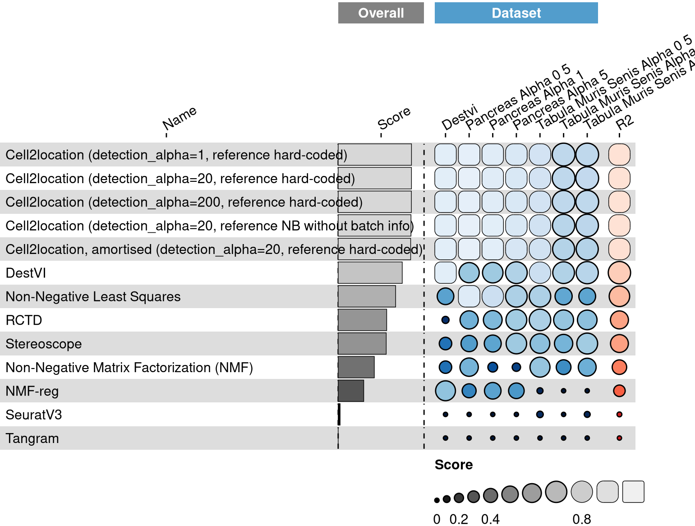
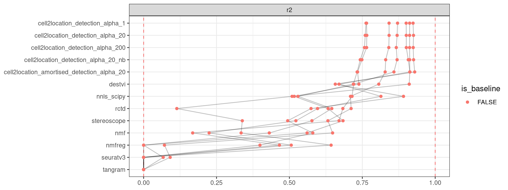

<link href="index_files/libs/datatables-css-0.0.0/datatables-crosstalk.css" rel="stylesheet" />

<link href="index_files/libs/dt-core-1.12.1/css/jquery.dataTables.min.css" rel="stylesheet" />
<link href="index_files/libs/dt-core-1.12.1/css/jquery.dataTables.extra.css" rel="stylesheet" />

<link href="index_files/libs/dt-ext-select-1.12.1/css/select.dataTables.min.css" rel="stylesheet" />

<link href="index_files/libs/dt-ext-searchpanes-1.12.1/css/searchPanes.dataTables.min.css" rel="stylesheet" />

<link href="index_files/libs/dt-ext-buttons-1.12.1/css/buttons.dataTables.min.css" rel="stylesheet" />

<link href="index_files/libs/crosstalk-1.2.0/css/crosstalk.min.css" rel="stylesheet" />

<link href="index_files/libs/lightable-0.0.1/lightable.css" rel="stylesheet" />

## Description

## The task

Spatial decomposition (also often referred to as Spatial deconvolution) is
applicable to spatial transcriptomics data where the transcription profile of
each capture location (spot, voxel, bead, etc.) do not share a bijective
relationship with the cells in the tissue, i.e., multiple cells may contribute
to the same capture location. The task of spatial decomposition then refers to
estimating the composition of cell types/states that are present at each capture
location. The cell type/states estimates are presented as proportion values,
representing the proportion of the cells at each capture location that belong to
a given cell type.

We distinguish between *reference-based* decomposition and *de novo*
decomposition, where the former leverage external data (e.g., scRNA-seq or
scNuc-seq) to guide the inference process, while the latter only work with the
spatial data. We require that all datasets have an associated reference single
cell data set, but methods are free to ignore this information.

## Summary

<figure>

<figcaption aria-hidden="true">Overview of the results per method. This figures shows the mean of the scaled scores (group Overall), the mean scores per dataset (group Dataset) and the mean scores per metric (group Metric).</figcaption>
</figure>

## Metrics

-   **r2**<a href="/bibliography#miles2005rsquared" target="_blank">1</a>: Missing 'metric_description'.

## Results

## Details

Methods

-   **Cell2location, amortised (detection_alpha=20, reference hard-coded)**<a href="/bibliography#kleshchevnikov2022cell2location" target="_blank">2</a>: Missing 'method_description'. Links: [Docs](https://github.com/BayraktarLab/cell2location).

<!-- -->

-   **Cell2location (detection_alpha=1, reference hard-coded)**<a href="/bibliography#kleshchevnikov2022cell2location" target="_blank">2</a>: Missing 'method_description'. Links: [Docs](https://github.com/BayraktarLab/cell2location).

<!-- -->

-   **Cell2location (detection_alpha=20, reference hard-coded)**<a href="/bibliography#kleshchevnikov2022cell2location" target="_blank">2</a>: Missing 'method_description'. Links: [Docs](https://github.com/BayraktarLab/cell2location).

<!-- -->

-   **Cell2location (detection_alpha=200, reference hard-coded)**<a href="/bibliography#kleshchevnikov2022cell2location" target="_blank">2</a>: Missing 'method_description'. Links: [Docs](https://github.com/BayraktarLab/cell2location).

<!-- -->

-   **Cell2location (detection_alpha=20, reference NB without batch info)**<a href="/bibliography#kleshchevnikov2022cell2location" target="_blank">2</a>: Missing 'method_description'. Links: [Docs](https://github.com/BayraktarLab/cell2location).

<!-- -->

-   **DestVI**<a href="/bibliography#lopez2022destvi" target="_blank">3</a>: Missing 'method_description'. Links: [Docs](https://github.com/YosefLab/scvi-tools).

<!-- -->

-   **Non-Negative Matrix Factorization (NMF)**<a href="/bibliography#cichocki2009fast" target="_blank">7</a>: Missing 'method_description'. Links: [Docs](https://scikit-learn.org/stable/modules/generated/sklearn.decomposition.NMF.html).

<!-- -->

-   **NMF-reg**<a href="/bibliography#rodriques2019slide" target="_blank">8</a>: Missing 'method_description'. Links: [Docs](https://github.com/tudaga/NMFreg_tutorial).

<!-- -->

-   **Non-Negative Least Squares**<a href="/bibliography#aliee2021autogenes" target="_blank">4</a>: Missing 'method_description'. Links: [Docs](https://docs.scipy.org/doc/scipy/reference/generated/scipy.optimize.nnls.html).

<!-- -->

-   **Random Proportions**<a href="/bibliography#openproblems" target="_blank">13</a>: Missing 'method_description'. Links: [Docs](https://github.com/openproblems-bio/openproblems).

<!-- -->

-   **RCTD**<a href="/bibliography#cable2021robust" target="_blank">5</a>: Missing 'method_description'. Links: [Docs](https://github.com/dmcable/spacexr).

<!-- -->

-   **SeuratV3**<a href="/bibliography#stuart2019comprehensive" target="_blank">9</a>: Missing 'method_description'. Links: [Docs](https://satijalab.org/seurat/archive/v3.2/spatial_vignette.html).

<!-- -->

-   **Stereoscope**<a href="/bibliography#andersson2020single" target="_blank">6</a>: Missing 'method_description'. Links: [Docs](https://github.com/scverse/scvi-tools).

<!-- -->

-   **Tangram**<a href="/bibliography#biancalani2021deep" target="_blank">10</a>: Missing 'method_description'. Links: [Docs](https://github.com/broadinstitute/Tangram).

<!-- -->

-   **True Proportions**<a href="/bibliography#openproblems" target="_blank">13</a>: Missing 'method_description'. Links: [Docs](https://github.com/openproblems-bio/openproblems).

Baseline methods

-   **Random Proportions**: Missing 'method_description'.

<!-- -->

-   **True Proportions**: Missing 'method_description'.

Datasets

-   **DestVI**<a href="/bibliography#lopez2022destvi" target="_blank">3</a>: Missing 'dataset_description'.

<!-- -->

-   **Pancreas (alpha=0.5)**<a href="/bibliography#luecken2022benchmarking" target="_blank">11</a>: Missing 'dataset_description'.

<!-- -->

-   **Pancreas (alpha=1)**<a href="/bibliography#luecken2022benchmarking" target="_blank">11</a>: Missing 'dataset_description'.

<!-- -->

-   **Pancreas (alpha=5)**<a href="/bibliography#luecken2022benchmarking" target="_blank">11</a>: Missing 'dataset_description'.

<!-- -->

-   **Tabula muris senis (alpha=0.5)**<a href="/bibliography#tabula2020single" target="_blank">12</a>: Missing 'dataset_description'.

<!-- -->

-   **Tabula muris senis (alpha=1)**<a href="/bibliography#tabula2020single" target="_blank">12</a>: Missing 'dataset_description'.

<!-- -->

-   **Tabula muris senis (alpha=5)**<a href="/bibliography#tabula2020single" target="_blank">12</a>: Missing 'dataset_description'.

Download raw data

<a href="data/task_info.json" class="btn btn-secondary">Task info</a>
<a href="data/method_info.json" class="btn btn-secondary">Method info</a>
<a href="data/metric_info.json" class="btn btn-secondary">Metric info</a>
<a href="data/dataset_info.json" class="btn btn-secondary">Dataset info</a>
<a href="data/results.json" class="btn btn-secondary">Results</a>
<a href="data/quality_control.json" class="btn btn-secondary">Quality control</a>

Quality control results

<table class="table lightable-paper" style='margin-left: auto; margin-right: auto; font-family: "Arial Narrow", arial, helvetica, sans-serif; margin-left: auto; margin-right: auto;'>
 <thead>
  <tr>
   <th style="text-align:left;"> Category </th>
   <th style="text-align:left;"> Name </th>
   <th style="text-align:right;"> Value </th>
   <th style="text-align:left;"> Condition </th>
   <th style="text-align:left;"> Severity </th>
  </tr>
 </thead>
<tbody>
  <tr>
   <td style="text-align:left;" data-toggle="tooltip" data-container="body" data-placement="right" title="Dataset metadata field 'dataset_description' should be defined
  Task id: spatial_decomposition
  Field: dataset_description
"> Dataset info </td>
   <td style="text-align:left;" data-toggle="tooltip" data-container="body" data-placement="right" title="Dataset metadata field 'dataset_description' should be defined
  Task id: spatial_decomposition
  Field: dataset_description
"> Pct 'dataset_description' missing </td>
   <td style="text-align:right;" data-toggle="tooltip" data-container="body" data-placement="right" title="Dataset metadata field 'dataset_description' should be defined
  Task id: spatial_decomposition
  Field: dataset_description
"> 1.000000 </td>
   <td style="text-align:left;" data-toggle="tooltip" data-container="body" data-placement="right" title="Dataset metadata field 'dataset_description' should be defined
  Task id: spatial_decomposition
  Field: dataset_description
"> percent_missing(dataset_info, field) </td>
   <td style="text-align:left;color: red !important;" data-toggle="tooltip" data-container="body" data-placement="right" title="Dataset metadata field 'dataset_description' should be defined
  Task id: spatial_decomposition
  Field: dataset_description
"> ✗✗ </td>
  </tr>
  <tr>
   <td style="text-align:left;" data-toggle="tooltip" data-container="body" data-placement="right" title="Method metadata field 'method_description' should be defined
  Task id: spatial_decomposition
  Field: method_description
"> Method info </td>
   <td style="text-align:left;" data-toggle="tooltip" data-container="body" data-placement="right" title="Method metadata field 'method_description' should be defined
  Task id: spatial_decomposition
  Field: method_description
"> Pct 'method_description' missing </td>
   <td style="text-align:right;" data-toggle="tooltip" data-container="body" data-placement="right" title="Method metadata field 'method_description' should be defined
  Task id: spatial_decomposition
  Field: method_description
"> 1.000000 </td>
   <td style="text-align:left;" data-toggle="tooltip" data-container="body" data-placement="right" title="Method metadata field 'method_description' should be defined
  Task id: spatial_decomposition
  Field: method_description
"> percent_missing(method_info, field) </td>
   <td style="text-align:left;color: red !important;" data-toggle="tooltip" data-container="body" data-placement="right" title="Method metadata field 'method_description' should be defined
  Task id: spatial_decomposition
  Field: method_description
"> ✗✗ </td>
  </tr>
  <tr>
   <td style="text-align:left;" data-toggle="tooltip" data-container="body" data-placement="right" title="Metric metadata field 'metric_description' should be defined
  Task id: spatial_decomposition
  Field: metric_description
"> Metric info </td>
   <td style="text-align:left;" data-toggle="tooltip" data-container="body" data-placement="right" title="Metric metadata field 'metric_description' should be defined
  Task id: spatial_decomposition
  Field: metric_description
"> Pct 'metric_description' missing </td>
   <td style="text-align:right;" data-toggle="tooltip" data-container="body" data-placement="right" title="Metric metadata field 'metric_description' should be defined
  Task id: spatial_decomposition
  Field: metric_description
"> 1.000000 </td>
   <td style="text-align:left;" data-toggle="tooltip" data-container="body" data-placement="right" title="Metric metadata field 'metric_description' should be defined
  Task id: spatial_decomposition
  Field: metric_description
"> percent_missing(metric_info, field) </td>
   <td style="text-align:left;color: red !important;" data-toggle="tooltip" data-container="body" data-placement="right" title="Metric metadata field 'metric_description' should be defined
  Task id: spatial_decomposition
  Field: metric_description
"> ✗✗ </td>
  </tr>
  <tr>
   <td style="text-align:left;" data-toggle="tooltip" data-container="body" data-placement="right" title="Method seuratv3 performs much worse than baselines.
  Task id: spatial_decomposition
  Method id: seuratv3
  Metric id: r2
  Worst score: -2.577283361629789%
"> Scaling </td>
   <td style="text-align:left;" data-toggle="tooltip" data-container="body" data-placement="right" title="Method seuratv3 performs much worse than baselines.
  Task id: spatial_decomposition
  Method id: seuratv3
  Metric id: r2
  Worst score: -2.577283361629789%
"> Worst score seuratv3 r2 </td>
   <td style="text-align:right;" data-toggle="tooltip" data-container="body" data-placement="right" title="Method seuratv3 performs much worse than baselines.
  Task id: spatial_decomposition
  Method id: seuratv3
  Metric id: r2
  Worst score: -2.577283361629789%
"> -2.577283 </td>
   <td style="text-align:left;" data-toggle="tooltip" data-container="body" data-placement="right" title="Method seuratv3 performs much worse than baselines.
  Task id: spatial_decomposition
  Method id: seuratv3
  Metric id: r2
  Worst score: -2.577283361629789%
"> worst_score &gt;= -1 </td>
   <td style="text-align:left;color: red !important;" data-toggle="tooltip" data-container="body" data-placement="right" title="Method seuratv3 performs much worse than baselines.
  Task id: spatial_decomposition
  Method id: seuratv3
  Metric id: r2
  Worst score: -2.577283361629789%
"> ✗✗ </td>
  </tr>
</tbody>
</table>

Visualization of raw results

